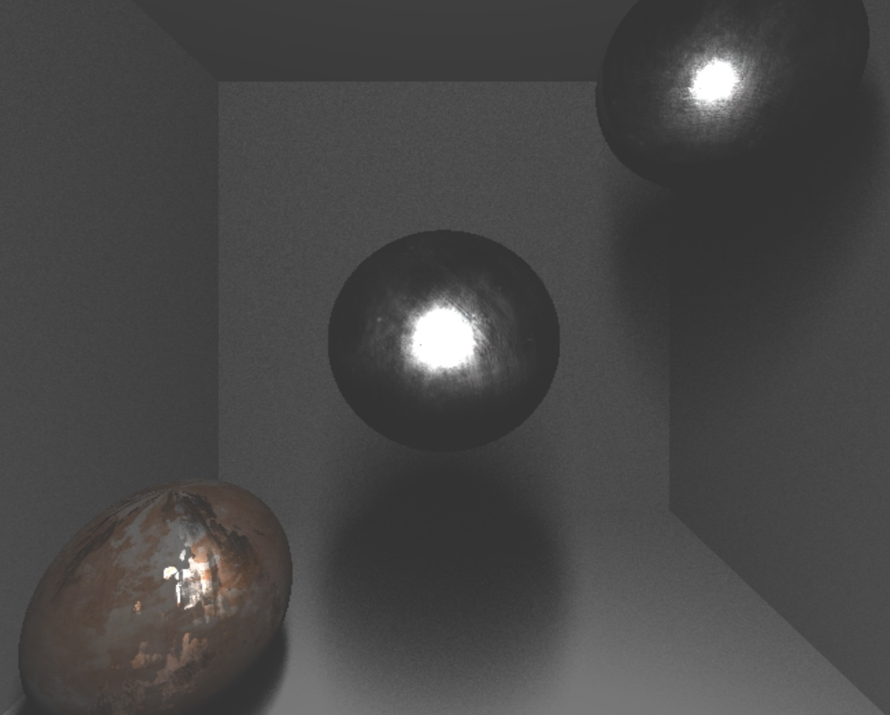

## Mine &middot; 

### About
This project focuses on learning and implementing ray tracing using a CPU-based approach. Ray tracing is a rendering technique that generates realistic images by simulating the way light interacts with objects in a virtual environment. This project explores the computational aspects of ray tracing on a CPU.

### Preview

#### Just a beginning

    

### Technology stack
- C++
- Xcode
- macOS

### Features
* Multi-bounce ray tracing
* Sampling techniques: nearest, linear
* Support for geometric shapes: 
    * Spheres
    * Planes
    * Disks
    * Triangles
* Lights
    * Omni
* Shading
    * PBR
    * Attenuation
    * Reflection
    * Soft-Shadows
* Multithreading

### Contributing
Contributions are welcome! Please fork the repository and submit a pull request. For major changes, please open an issue first to discuss what you would like to change.

### Contact
For support or inquiries, please open an issue on the [GitHub repository](https://github.com/mateuszstompor/mine/issues).
